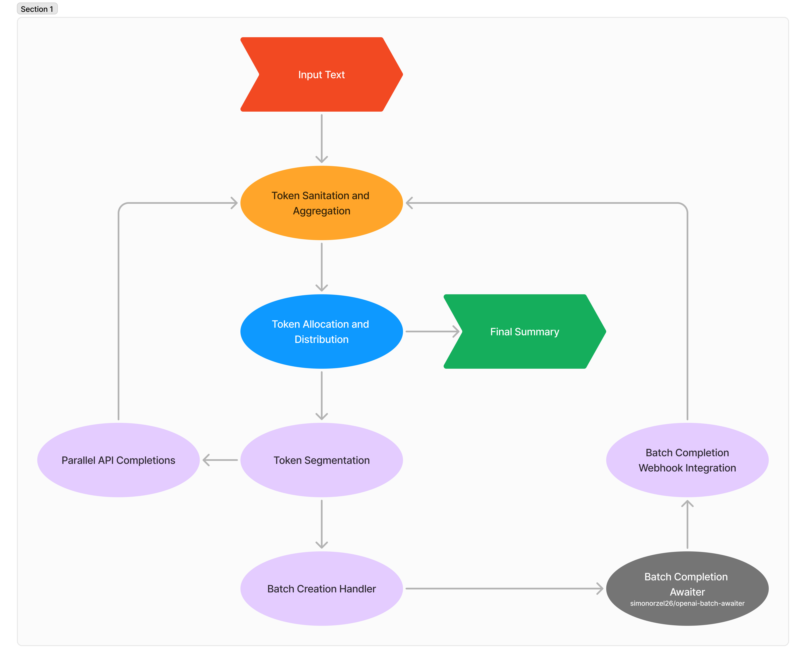

# Recursive Summarizer with OpenAI LLM

This project implements a recursive summarizer using OpenAI's Language Learning Model (LLM) with Bun and TypeScript. The summarizer efficiently handles large text datasets by recursively dividing, processing, and summarizing them in batches.




## Features

- **Initialize Input Text**: Starts the summarization process by accepting raw text input.
- **Token Sanitation and Aggregation**: Cleans and combines tokens for optimal processing.
- **Token Allocation and Distribution**: Manages token counts and allocates them across multiple API calls.
- **Parallel API Completions**: Executes multiple OpenAI API completions concurrently to maximize efficiency.
- **Token Segmentation**: Divides tokens into segments suitable for batch processing.
- **Batch Completion Webhook Integration**: Integrates with a webhook to manage batch processing asynchronously.
- **Batch Creation Handler**: Facilitates the creation of multiple batches for parallel processing.
- **Batch Completion Awaiter**: Waits for all batch completions before aggregating results.
- **Finalize Summary**: Aggregates results to produce a comprehensive summary of the input text.

## Installation

To use the recursive summarizer, clone the repository and install the necessary dependencies:

```bash
git clone https://github.com/simonorzel26/recursive-summarizer.git
cd recursive-summarizer
bun install
```

## Usage

To start the summarization process:

```bash
bun run src/summarizer.ts --input your_text_file.txt --output summary.txt
```

This command will process the input text file, summarize it using the recursive summarizer, and save the output in the specified file.

## Configuration

You can customize token limits, batch sizes, and other parameters in the `config.json` file according to your needs.

## Development

If you're contributing or modifying the project:

1. **Install Dependencies**: Ensure all dependencies are installed with `bun install`.
2. **Run Tests**: Use `bun test` to run any existing tests.
3. **Linting**: Make sure your code adheres to the project's style guide by running `bun lint`.

## Contributing

Contributions are welcome! Please fork this repository and submit a pull request with your changes.

## License

This project is licensed under the MIT License. See the `LICENSE` file for details.
